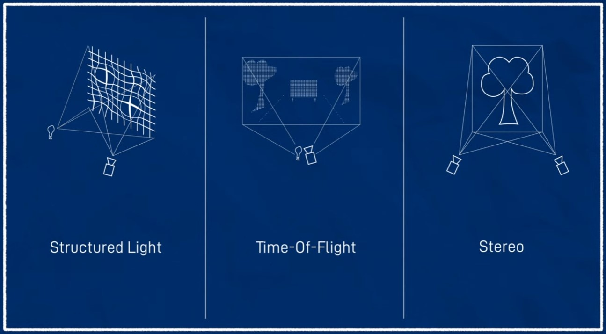
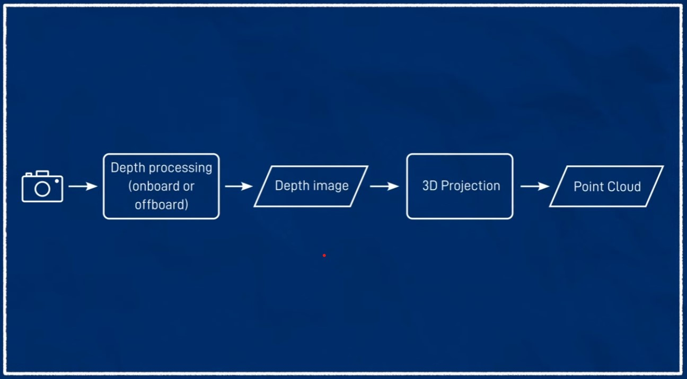
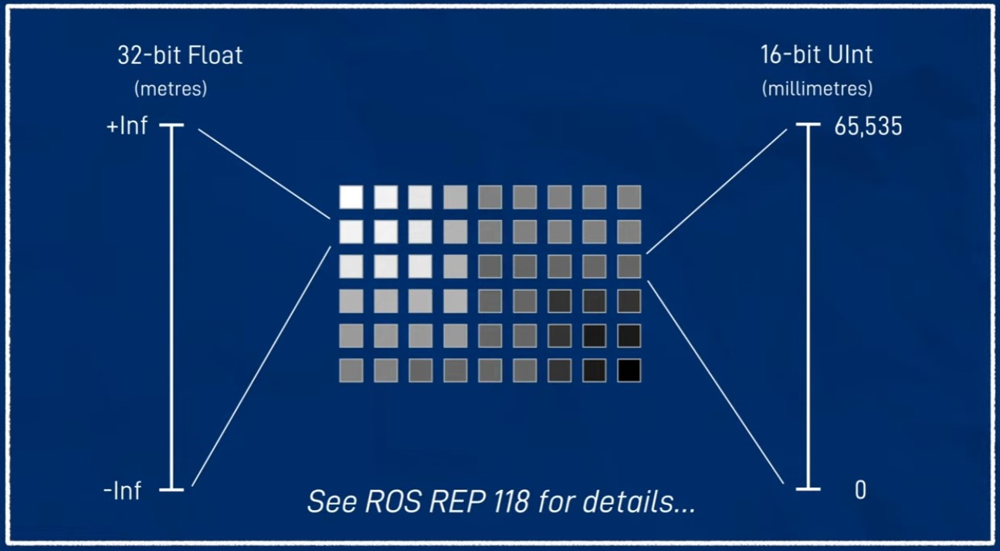
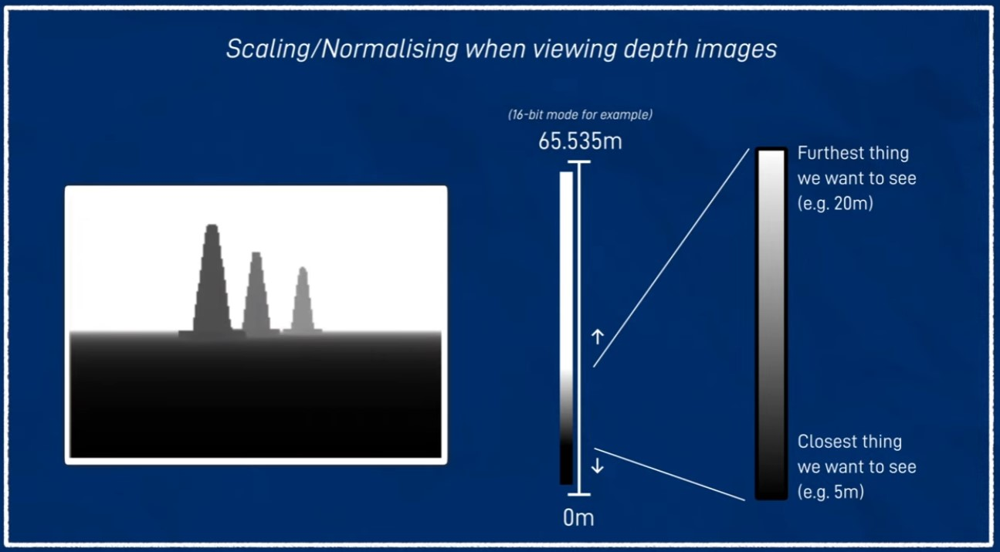

# 为你的小车添加深度摄像头

## 关于深度相机你需要了解的事情

深度相机有多种技术实现方式，以下是三种常见的深度相机技术的简要介绍（图片来自[JoshNewans的视频](https://www.youtube.com/watch?v=T9xZ22i9-Ys&list=PLunhqkrRNRhYAffV8JDiFOatQXuU-NnxT&index=10)）：



- 结构光 (Structured Light)：结构光技术通过投射特定模式的光（通常是条纹或网格）到场景中，然后使用摄像头捕捉到反射回来的光图像。由于物体表面存在高低起伏，反射回来的光图案会发生形变，系统通过分析这种形变来计算每个点的深度信息。

- 飞行时间 (Time of Flight, ToF)：飞行时间技术通过发射一个光脉冲（通常是红外光）到场景中，然后测量光从发射到返回的时间差，利用这个时间差来计算每个点的深度信息。ToF相机通常会发射成千上万次光脉冲，以生成整个场景的深度图。

- 立体视觉 (Stereo Vision)：立体视觉技术通过使用两台或多台摄像头从不同角度拍摄同一场景，然后利用视差原理（物体在不同视角下的位置差异）来计算深度信息。通过匹配左右两幅图像中的同一物体的特征点，立体相机可以推算出物体距离摄像机的距离。

在实际应用中，我们通常会先通过在线/离线的深度处理计算得到深度图像，然后使用3D投影功能来得到场景的点云信息（图片来自[JoshNewans的视频](https://www.youtube.com/watch?v=T9xZ22i9-Ys&list=PLunhqkrRNRhYAffV8JDiFOatQXuU-NnxT&index=10)）：



在ROS2标准中，深度图像信息一般以两种形式存储（图片来自[JoshNewans的视频](https://www.youtube.com/watch?v=T9xZ22i9-Ys&list=PLunhqkrRNRhYAffV8JDiFOatQXuU-NnxT&index=10)）：

- 32位浮点型：对应的单位是米

- 16位无符号整型：对应的单位是毫米



值得注意的是，我们一般会对接收到的深度图像进行缩放/标准化，用来过滤掉过近/过远的无效信息（图片来自[JoshNewans的视频](https://www.youtube.com/watch?v=T9xZ22i9-Ys&list=PLunhqkrRNRhYAffV8JDiFOatQXuU-NnxT&index=10)）：




## 在Gazebo仿真环境中为小车添加深度相机

### 添加深度相机插件

为了在Gazebo中添加深度相机，我们在`~/(工作空间名字)/src/(package名字)/description`路径下新建一个`depth_camera.xacro`文件，用于添加深度相机插件。在新建完成后，不要忘记重新编译项目：

```
cd ~/(工作空间名字)
colcon build --symlink-install
```

同时，在`robot.urdf.xacro`文件当中引用我们新建的xacro文件：

`<xacro:include filename="depth_camera.xacro"/>`

这里，我们省略掉关节和link的定义部分（因为和RGB相机完全一样）。接下来，我们就可以开始添加深度相机插件了（[完整代码](https://github.com/NUSShao/mobile_bot/blob/main/description/depth_camera.xacro)）：

```
    <gazebo reference="depth_camera_link">
        
        <!-- Color definition in Gazebo -->
        <material>Gazebo/Black</material>
        <!-- Sensor tag for camera -->
        <sensor name="depth_camera" type="depth">

            <pose> 0 0 0 0 0 0 </pose>
            <visualize>true</visualize>
            <update_rate>10</update_rate>
            <!-- camera params -->
            <camera>
                <!-- Field of Vision -->
                <horizontal_fov>1.089</horizontal_fov>
                <!-- image params -->
                <image>
                    <format>R8G8B8</format>
                    <width>640</width>
                    <height>480</height>
                </image>
                <!-- image clip -->
                <clip>
                    <near>0.05</near>
                    <far>8.0</far>
                </clip>

            </camera>
            <!-- gazebo camera control plugin -->
            <plugin name="depth_camera_controller" filename="libgazebo_ros_camera.so">
                <frame_name>depth_camera_link_optical</frame_name>
            </plugin>

        </sensor>

    </gazebo>
```

### 由于虚拟机无法渲染3D点云，这里的渲染结果后续再更~