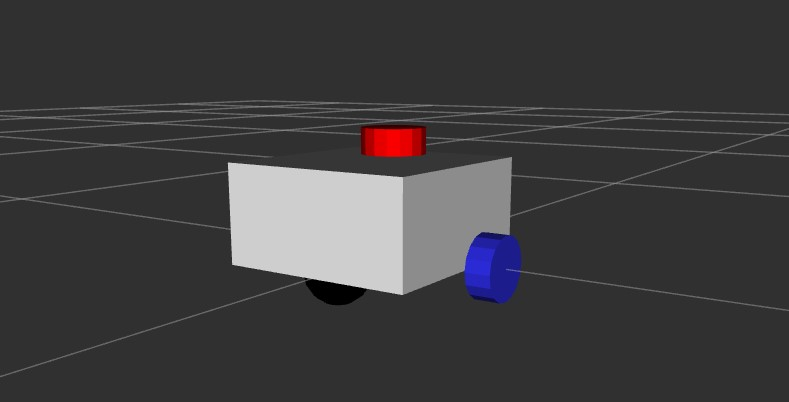
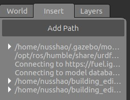
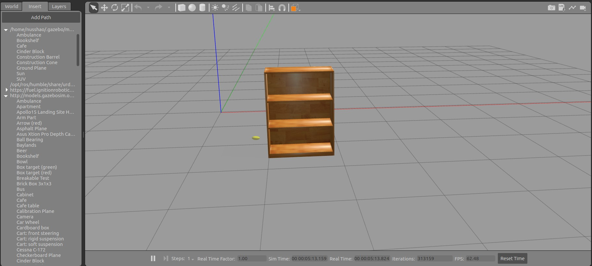
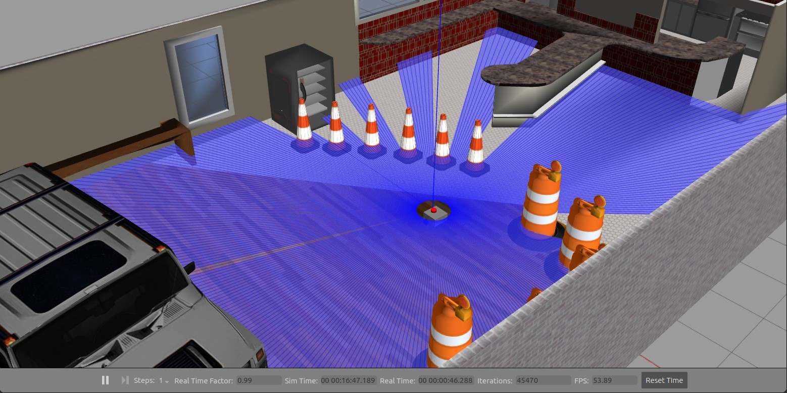
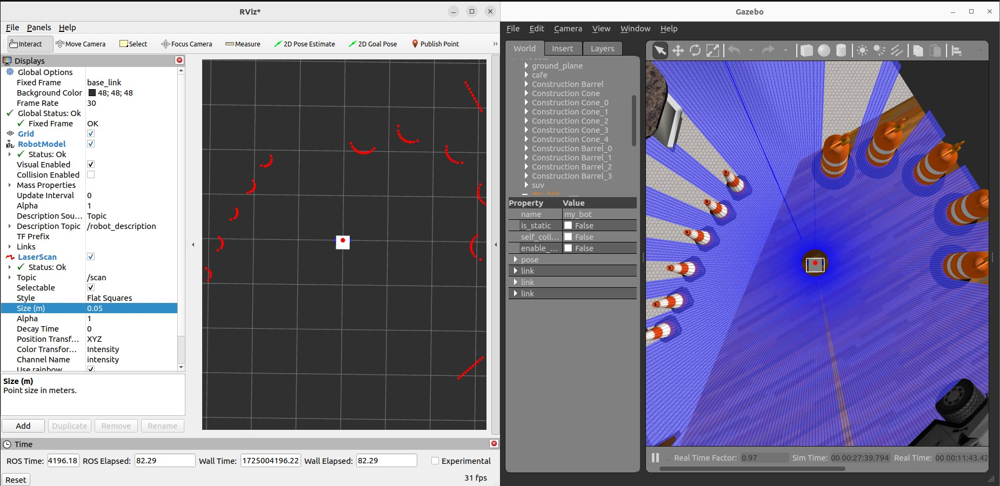

# 为你的小车添加LiDAR

## 什么是LiDAR？它能做什么？

LiDAR（Light Detection and Ranging）是一种基于激光的探测和测量技术，用于测量目标物体的距离、速度和形状等信息。LiDAR系统通过发射激光脉冲并测量这些脉冲反射回来的时间来计算目标物体的距离。

与雷达 Radar（基于无线电波）不同，LiDAR使用的是光波，通常在紫外线、可见光或近红外光谱范围内工作。

- 一维雷达（1-Dimensional LiDAR）：发射一条线光束，可以用来点到点测距。

- 二位雷达（2-Dimensional LiDAR）：在一个固定高度上360°发射光束，可以用来平面建图。在ROS2中，对应的传感器数据类型为`sensor_msgs/LaserScan`。

- 三位雷达（3-Dimensional LiDAR）：向三维空间中各个方向发射光束，可以用来三维建图。在ROS2中，对应的传感器数据类型为`sensor_msgs/PointCloud2`。

## 在Gazebo仿真环境中为小车添加LiDAR

### 添加LiDAR插件

为了在Gazebo中添加雷达，我们在`~/(工作空间名字)/src/(package名字)/description`路径下新建一个`lidar.xacro`文件，用于添加雷达插件。在新建完成后，不要忘记重新编译项目：

```
cd ~/(工作空间名字)
colcon build --symlink-install
```

同时，在`robot.urdf.xacro`文件当中引用我们新建的xacro文件：

`<xacro:include filename="lidar.xacro"/>`

接下来，我们就可以开始添加lidar了。

首先，我们在chassis（底盘）上创建一个joint，用来固定雷达（这里原点位置没有校准，最终数值见[完整代码](https://github.com/NUSShao/mobile_bot/blob/main/description/lidar.xacro)）：

```
    <joint name="chassis_laser_joint" type="fixed">

        <parent link="chassis_link" />
        <child link="laser_frame" />
        <origin xyz="0 0 0" rpy="0 0 0" />

    </joint>
```

接下来，我们在`robot_core.xcaro`文件中添加一个红色的material：

```
    <material name="red">
        <color rgba="1 0 0 1" />
    </material>
```

然后我们创建对应的`laser_frame` link：

```
    <link name="laser_frame">

        <visual>
            <geometry>
                <cylinder radius="0.05" length="0.04" />
            </geometry>
            <material name="red" />
        </visual>

        <collision>
            <geometry>
                <cylinder radius="0.05" length="0.04" />
            </geometry>
        </collision>

        <xacro:inertial_cylinder mass="0.1" length="0.04" radius="0.05">
            <origin xyz="0 0 0" rpy="0 0 0" />
        </xacro:inertial_cylinder>

    </link>
```

然后，我们打开Rviz2，添加TF和RobotModel，并且将topic设置对，就可以在里面看到我们新加的雷达了：



接下来，我们为雷达link添加Gazebo标签，其中包含了颜色定义以及传感器的参数信息（有点长，但是我加了一些英文的注释）：

```
    <gazebo reference="laser_frame">
        
        <!-- Color definition in Gazebo -->
        <material>Gazebo/Red</material>

        <!-- ray type sensor -->
        <sensor name="laser" type="ray">

            <!-- x y z roll pitch yall (relative to the world frame) -->
            <pose> 0 0 0 0 0 0 </pose>
            <visualize>true</visualize>
            <update_rate>10</update_rate>
            <ray>
                <scan>
                    <!-- 2D Lidar so no vertical tag -->
                    <horizontal>
                        <samples>360</samples>
                        <min_angle>-3.14</min_angle>
                        <max_angle>3.14</max_angle>
                    </horizontal>
                </scan>
                <range>
                    <min>0.3</min>
                    <max>12</max>
                </range>
            </ray>

            <!-- laser controller plugin -->
            <plugin name="laser_controller" filename="libgazebo_ros_ray_sensor.so">
                <ros>
                    <argument>~/out:=scan</argument>
                </ros>
                <output_type>sensor_msgs/LaserScan</output_type>
                <frame_name>laser_frame</frame_name>
            </plugin>

        </sensor>

    </gazebo>
```

接下来，为了在Gazebo中测试一下我们的雷达，我们先创建一个被障碍包裹的Gazebo world文件，在Terminal中输入：

`ros2 launch gazebo_ros gazebo.launch.py`

在打开Gazebo以后，我们点开左侧的`Insert`一栏：



等待片刻，我们连接到Gazebo提供的模型数据库之后，就可以在场景中一键创建模型了：



在创建好模型之后，我们按下`Ctrl+Shift+S`，将world文件保存在`~/(工作空间名字)/src/(project名字)/worlds`目录下，记得以world后缀来结束。

然后，我们在terminal中输入以下指令，来启动状态发布器以及我们刚才创建的Gazebo world文件：

```
cd ~/(工作空间名字)/src/(project名字)
ros2 launch mobile_bot rsp_sim.launch.py world:=worlds/(world文件名字).world
```

然后，我们就能在Gazebo中看到生成好的世界模型，以及带有雷达的机器人实体：



我们可以驱动小车，可以看到雷达信息会随着小车位置而更新：


这时，我们回到Rviz2，添加一个`LaserScan`选项，按照下图配置，就可以看到扫描到的障碍物：



