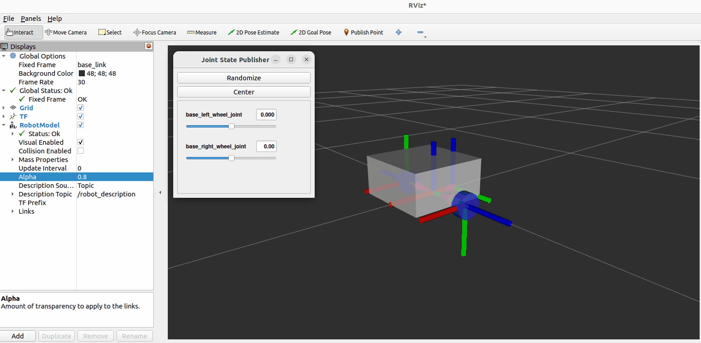
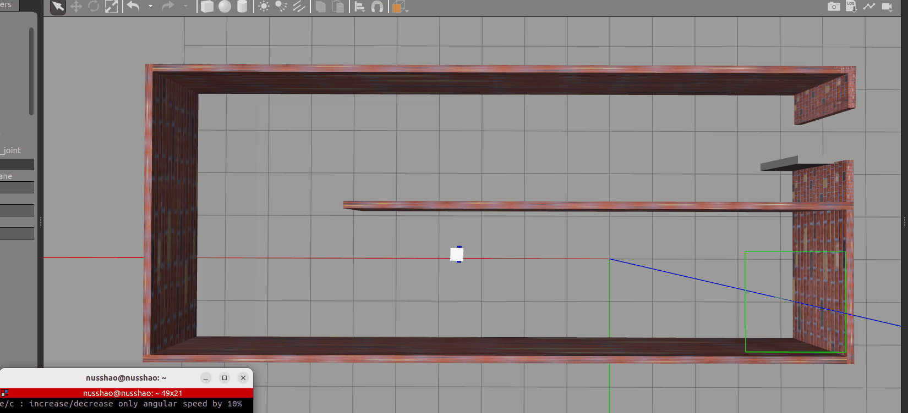

## Robot Package Template

This is a GitHub template. You can make your own copy by clicking the green "Use this template" button.

It is recommended that you keep the repo/package name the same, but if you do change it, ensure you do a "Find all" using your IDE (or the built-in GitHub IDE by hitting the `.` key) and rename all instances of `my_bot` to whatever your project's name is.

Note that each directory currently has at least one file in it to ensure that git tracks the files (and, consequently, that a fresh clone has direcctories present for CMake to find). These example files can be removed if required (and the directories can be removed if `CMakeLists.txt` is adjusted accordingly).

# 简介

以上是来自原作者Josh Newans（油管频道叫做Articulated Robotics）的Introduction。

## 准备工作

见[Setup.md](https://github.com/BIT-Gs/mobile_bot/blob/main/Setup.md)

## URDF/XACRO建模

见[model.md](https://github.com/BIT-Gs/mobile_bot/blob/main/model.md)

## Gazebo仿真

见[Simulation.md](https://github.com/BIT-Gs/mobile_bot/blob/main/Simulation.md)

