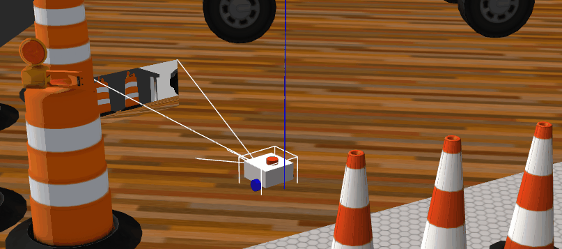

## Robot Package Template

This is a GitHub template. You can make your own copy by clicking the green "Use this template" button.

It is recommended that you keep the repo/package name the same, but if you do change it, ensure you do a "Find all" using your IDE (or the built-in GitHub IDE by hitting the `.` key) and rename all instances of `my_bot` to whatever your project's name is.

Note that each directory currently has at least one file in it to ensure that git tracks the files (and, consequently, that a fresh clone has direcctories present for CMake to find). These example files can be removed if required (and the directories can be removed if `CMakeLists.txt` is adjusted accordingly).

# 简介

以上是来自原作者Josh Newans（油管频道叫做Articulated Robotics）的Introduction。

本项目记录了我参照Josh Newans的系列视频进行ROS2&Gazebo学习的详细流程，其中所有的代码细节都有呈现，没有跳步骤，和我一样的初学者可以放心食用。

## 准备工作

见[Setup.md](https://github.com/NUSShao/mobile_bot/blob/main/Setup.md)

## URDF/XACRO建模

见[model.md](https://github.com/NUSShao/mobile_bot/blob/main/model.md)

## Gazebo仿真

见[Simulation.md](https://github.com/NUSShao/mobile_bot/blob/main/Simulation.md)

## Gazebo & Lidar

见[Lidar.md](https://github.com/NUSShao/mobile_bot/blob/main/Lidar.md)

## Gazebo & Camera

见[Camera.md](https://github.com/NUSShao/mobile_bot/blob/main/Camera.md)

## Gazebo & Depth Camera

见[DepthCamera.md](https://github.com/NUSShao/mobile_bot/blob/main/DepthCamera.md)

暂时没完成，后续上图，可以先看后面的章节，不影响理解。

## Gazebo & ROS2 Control

见[ROS2Control.md](https://github.com/NUSShao/mobile_bot/blob/main/ROS2Control.md)

