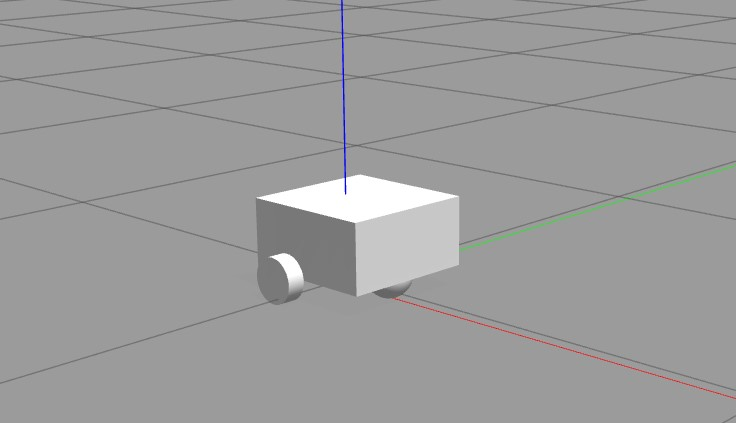
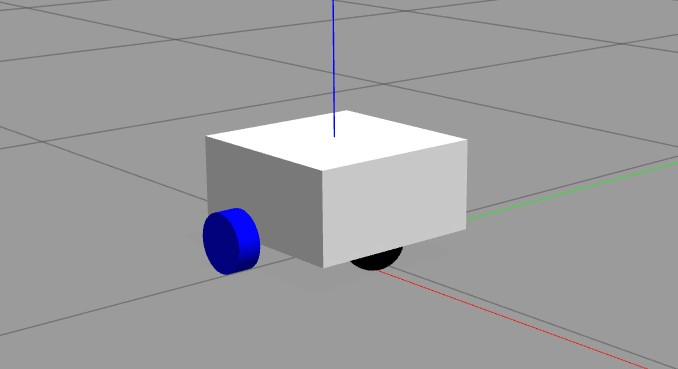
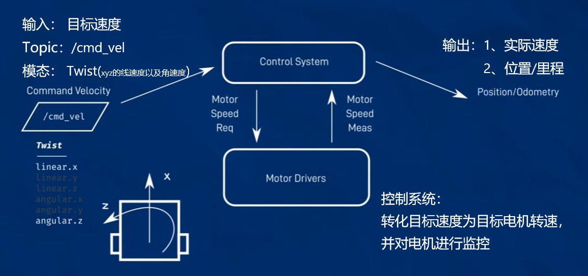
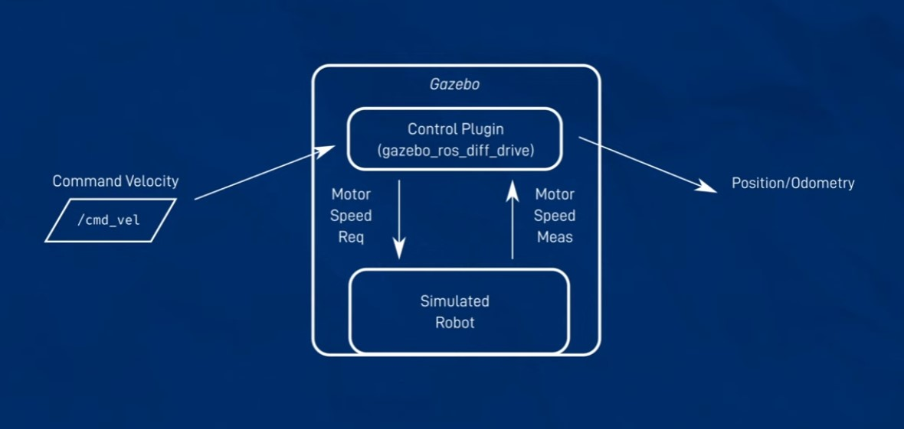
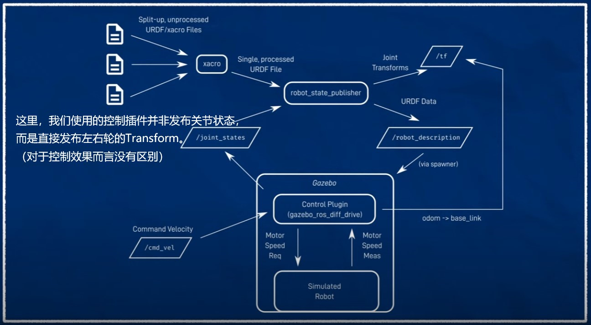

# 利用编辑好的模型进行仿真

## 在Gazebo中生成模型

### 运行状态发布器

首先，在生成模型之前，我们需要在ROS2中运行状态发布器：

`ros2 launch (package名字) rsp.launch.py use_sim_time:=true`

注意，这里将use_sim_time设置为了True，是为了让ROS2节点的时间与Gazebo仿真环境中的时间对齐。

另外，你可以启动一个额外的Terminal，用以下指令检查是否设置成功：

`ros2 param get /robot_state_publisher use_sim_time`

### 启动gazebo环境

另启动一个Terminal，输入以下指令，启动Gazebo：

`ros2 launch gazebo_ros gazebo.launch.py`

### 生成机器人实体

接下来，我们使用gazebo_ros包中自带的功能生成机器人实体：

`ros2 run gazebo_ros spawn_entity.py -topic robot_description -entity my_bot`

随后，我们的小车就出现在Gazebo中了：



## 打包启动指令

依次重新运行前面的三条指令比较冗余，因此JoshNewans大佬为我们写好了一份[更方便的launch文件](https://github.com/joshnewans/articubot_one/blob/adb08202d3dafeeaf8a3691ddd64aa8551c40f78/launch/launch_sim.launch.py)

我们只需在package文件夹下的launch子文件夹中新建一个`rsp_sim.launch.py`的文件，将内容复制进去即可。

同时，别忘了为新建的文件重新build一下你的package：

```
cd ~/(工作空间名字)
colcon build --symlink-install
```

完成之后，运行一下我们的launch文件就可以一次性将机器人模型放到Gazebo中了：

`ros2 launch mobile_bot rsp_sim.launch.py`

## 为小车添加Gazebo颜色

观察上一节中，我们在Gazebo中生成的小车实体是没有颜色的。
这是因为urdf文件中的material没有办法被Gazebo识别。

为此，我们需要为每一个Link添加一个Gazebo插件，来赋予小车正确的颜色。

这里还是以Chassis Link为例：([完整代码](https://github.com/BIT-Gs/mobile_bot/blob/main/description/robot_core.xacro))

```
<link name="chassis_link">

    <visual>
        ...
    </visual>

    <collision>
        ...
    </collision>

    <xacro:inertial_box mass="0.5" x="0.3" y="0.3" z="0.15">
        ...
    </xacro:inertial_box>

</link>

<!-- 这里是新增部分 -->
<gazebo reference="chassis_link">
    <material>Gazebo/White</material>
</gazebo>
```

对于其他Link，我们照做。

全部完成后，我们在Terminal中按下`Ctrl+C`，重新launch我们的启动文件`rsp_sim.launch.py`，可以看到我们的小车已经在Gazebo中上色了：



## 控制系统 & Gazebo

在正式开始控制小车运动之前，我们先来理清小车控制系统的架构，以及它与Gazebo的结合关系。

首先是小车的控制系统架构（图片来自[JoshNewans的视频](https://www.youtube.com/watch?v=IjFcr5r0nMs&t=242s)）：



在控制系统中，输入是目标速度（对于我们的小车，只有x方向线速度以及z方向角速度），而输出则是实际速度（由IMU（惯性测量单元）测得），或是位置/里程（由死算得到）。

```
死算（Dead Reckoning，简称DR）是一种导航技术，用于估计一个物体的位置，而不依赖于外部参考点。其原理是从已知的初始位置开始，根据速度、方向、航向、以及时间等参数，通过推算来估计当前位置。死算常用于飞行器、船只、潜艇等在无法获得GPS等外部定位信息时的导航。
```

对于仿真系统而言，整个框架如下（图片来自[JoshNewans的视频](https://www.youtube.com/watch?v=IjFcr5r0nMs&t=242s)）：



与实际控制系统不同，仿真控制系统通过Gazebo来模拟机器人的状态，并使用控制插件（一般用的是ros2_control，由于比较复杂，这里使用gazebo自带的差速驱动插件）来实现小车的驱动。

对于整个ROS2而言，Gazebo仿真控制系统接收来自/robot_description的信息，在仿真环境中生成机器人，对其进行控制，并输出仿真得到的机器人关节信息，发布到/joint_state话题中。如此，构成了仿真的运行循环（图片来自[JoshNewans的视频](https://www.youtube.com/watch?v=IjFcr5r0nMs&t=242s)）：



值得注意的是，这里我们使用的控制插件会另外输出一个`odom`坐标系，通过对比它与`base_link`之间的Transform，我们可以知道机器人当前的位置。

## 添加Gazebo控制插件

为了在Gazebo中实现控制，我们在`~/(工作空间名字)/src/(package名字)/description`路径下新建一个`gazebo_control.xacro`文件，用于添加控制插件。在新建完成后，不要忘记重新编译项目：

```
cd ~/(工作空间名字)
colcon build --symlink-install
```

同时，在`robot.urdf.xacro`文件当中引用我们新建的xacro文件：

`<xacro:include filename="gazebo_control.xacro"/>`

接下来，我们就可以开始添加插件了([完整代码]())：

```    
    <gazebo>
        <plugin name="diff_drive" filename="libgazebo_ros_diff_drive.so">
            <!-- 这里添加插件参数 -->
        </plugin>
    </gazebo>
```

